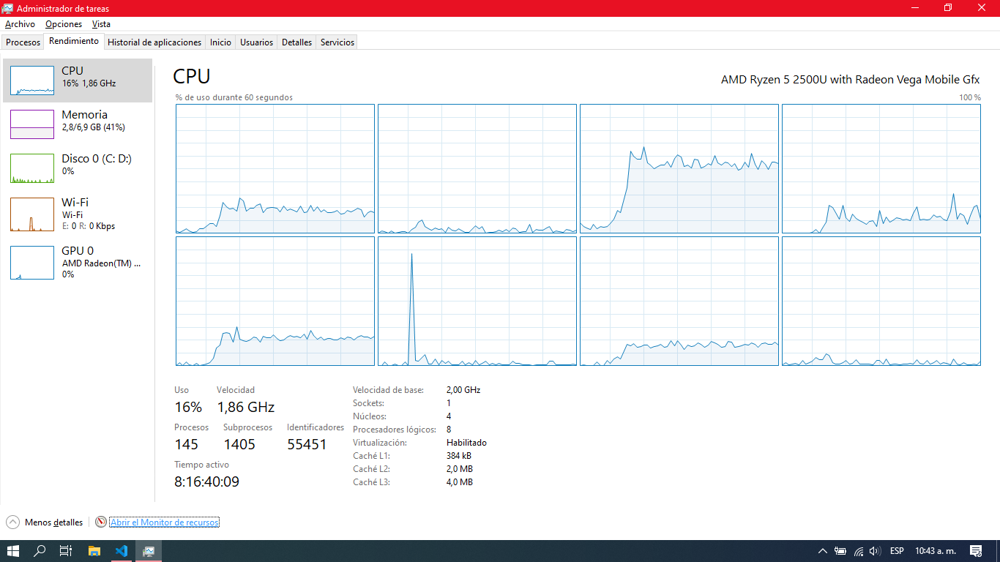
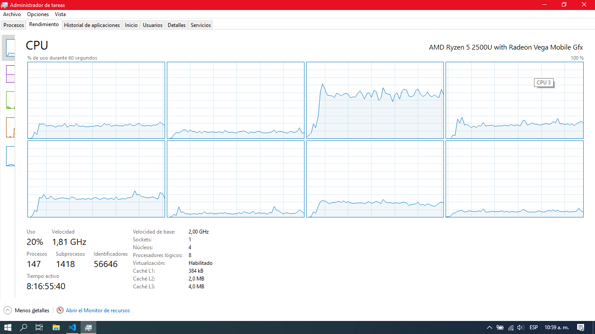

# LABORATORIO 1 P2 DOGS RACE CASE

## Parte 1

### Istrucciones de ejecución y compilación

Para descargargar el proyecto, abrimos la consola e ingresamos al directorio donde se alojará y escribimos el siguiente código:

``` $ git clone https://github.com/JulianGutierritos/ARSW-LAB01-P2.git ```

Hecho esto, ingresamos a la parte 1 del proyecto

``$ cd parte1``

Y desde allí podremos ejecutar la clase principal mediante el siguiente comando:

``$ mvn exec:java -Dexec.mainClass="edu.eci.arsw.primefinder.Main" ``

### Respuestas de las preguntas

1. Review the "concurrent cousins" program (in the folder part1), provided in the package edu.eci.arsw.primefinder. This is a program that calculates the prime numbers between two intervals, distributing their search among independent threads. For now, it has a single thread that seeks cousins ​​between 0 and 30,000,000. Run it, open the operating system process manager, and verify how many cores are used by it.




    Después de ejecutar el programa usando solo 1 Thread y visualizar el uso de los cores, podemos ver en la imagen que se están usando 4 de los 8 cores que tiene la PC, ya que se puede notar un cambio mas brusco en lso picos de uso.

1. Modify the program so that, instead of solving the problem with a single thread, do it with three, where each of these will make up the first part of the original problem. Check the operation again, and again check the use of the equipment cores



    Después de ejecutar el programa usando 3 Threads y visualizar el uso de los cores, podemos ver que el rendimiento de los cores que se usaron en el punto anterior aumentó un poco, además aumentó a 5 la cantidad de cores que intervienen en el proceso.

## Parte 2.

Una vez descargado el proyecto, como se explicó en la parte 1, accedemos al directorio corresponidiente de la parte 2 del proyecto.

``$ cd parte2``

E ingresamos el siguiente código para ejecutar el programa:

``$ mvn exec:java -Dexec.mainClass="edu.eci.arsw.threads.MainCanodromo"``

Una vez hecho esto nos saldra una ventana correspondiente al GUI del programa, donde podrá interactuar con este.